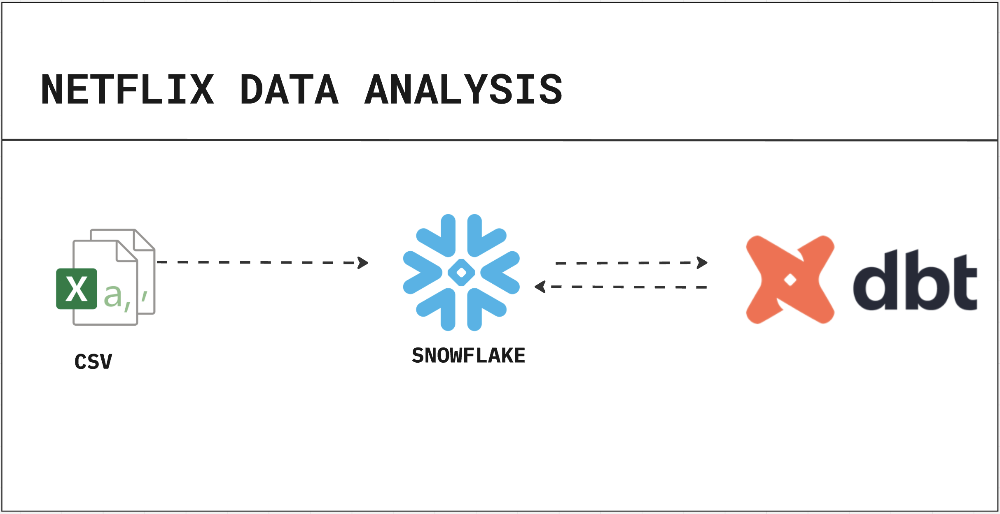

<div align="center">

# Netflix / MovieLens Data Warehouse

**Dimensional Data model — dbt Core + Snowflake**

[](https://www.getdbt.com/)
[](https://www.snowflake.com/)
[](https://www.python.org/)
[](https://docs.astral.sh/uv/)
[](https://github.com/DOthedot/netflix_data_analysis/actions)
[](LICENSE)

*Raw MovieLens data → staging → dimensional warehouse → analytics-ready marts*

</div>

---

## Architecture



---

## Overview

This project transforms the public [MovieLens ml-20m](https://grouplens.org/datasets/movielens/) dataset into a fully tested dimensional warehouse on **Snowflake** using **dbt Core**.  
It demonstrates production patterns for:

- Multi-layer modelling (staging → dim → fct → mart)
- Incremental fact tables with surrogate keys
- Bayesian rating aggregation & genre analytics
- Source freshness checks, relationship tests, range tests
- SCD-style snapshots with `dbt_utils.generate_surrogate_key`
- Environment-aware schema routing via `generate_schema_name` macro
- GitHub Actions CI with lint (ruff + sqlfluff), parse, run, and test stages

---

## Data Architecture

```
Raw (Snowflake)
    │
    ▼
┌─────────────────────────────────────┐
│            STAGING (views)          │
│  src_movies  src_ratings  src_tags  │
│  src_links   src_genome_score       │
│              src_genome_tags        │
└─────────────┬───────────────────────┘
              │
    ┌─────────┴──────────┐
    ▼                    ▼
┌──────────┐      ┌─────────────────┐
│   DIM    │      │      FCT        │
│(tables)  │      │  (incremental)  │
│          │      │                 │
│dim_movies│      │fct_ratings      │
│dim_users │      │fct_genome_scores│
│dim_genome│      └────────┬────────┘
│   _tags  │               │
└────┬─────┘               │
     └──────────┬──────────┘
                ▼
┌───────────────────────────────────────────────────┐
│                    MART (tables)                  │
│  mart_top_rated_movies   mart_genre_performance   │
│  mart_user_activity      mart_movie_release_dates │
│  mart_movies_enriched                             │
└───────────────────────────────────────────────────┘
```

### Layer Reference

| Layer | Materialisation | Schema | Purpose |
|-------|----------------|--------|---------|
| Staging | View | `<env>_staging` | Rename + type-cast raw columns; no business logic |
| Dim | Table | `<env>_dim` | Slowly-changing dimensions (movies, users, tags) |
| Fct | Incremental | `<env>_fct` | Append-only event facts (ratings, genome scores) |
| Mart | Table | `<env>_mart` | Denormalised, analytics-ready aggregations |

---

## Mart Models

| Model | Grain | Key Metrics |
|-------|-------|-------------|
| `mart_top_rated_movies` | Movie | Bayesian avg rating, total ratings, rank |
| `mart_genre_performance` | Genre × Year | Avg rating, volume, unique raters |
| `mart_user_activity` | User | Total ratings, avg rating given, user segment |
| `mart_movie_release_dates` | Movie | Release date, rating stats for BI tools |
| `mart_movies_enriched` | Movie × Tag | Genome relevance, IMDb/TMDb links |

---

## Tech Stack

| Concern | Tool |
|---------|------|
| Warehouse | Snowflake |
| Transform | dbt Core 1.9+ |
| Packages | dbt_utils |
| Package mgr | uv |
| Language | Python 3.13+ |
| Linting | ruff, sqlfluff |
| CI | GitHub Actions |

---

## Project Structure

```
netflix_data_analysis/
├── .github/
│   └── workflows/
│       └── dbt-ci.yml            # Lint → parse → run → test pipeline
├── netflix/                      # dbt project root
│   ├── models/
│   │   ├── sources.yml           # Source declarations + freshness SLAs
│   │   ├── staging/              # src_* views — thin wrappers over raw tables
│   │   │   └── schema.yml
│   │   ├── dim/                  # Dimension tables
│   │   │   └── schema.yml
│   │   ├── fct/                  # Incremental fact tables
│   │   │   └── schema.yml
│   │   └── mart/                 # Analytics-ready denormalised tables
│   │       └── schema.yml
│   ├── macros/
│   │   ├── generate_schema_name.sql   # Env-aware schema routing
│   │   └── full_table_null_check.sql  # Null-audit helper
│   ├── snapshots/
│   │   └── snap_tags.sql         # SCD tracking for user tags
│   ├── seeds/
│   │   └── seed_movie_release_dates.csv
│   ├── analyses/
│   │   └── movie_analysis.sql    # Top-rated movies ad-hoc query
│   ├── tests/
│   │   └── relevance_score_test.sql
│   ├── dbt_project.yml
│   └── packages.yml
├── profiles.yml.example          # Connection template (never commit the real file)
├── pyproject.toml                # Python deps managed by uv
├── uv.lock
└── README.md
```

---

## Prerequisites

| Requirement | Notes |
|-------------|-------|
| Python 3.13+ | `python --version` |
| [uv](https://docs.astral.sh/uv/) | `curl -LsSf https://astral.sh/uv/install.sh \| sh` |
| Snowflake account | Free trial at snowflake.com |
| MovieLens data in Snowflake | See [Loading data](#loading-movielens-data) below |

---

## Quick Start

### 1. Clone & install

```bash
git clone https://github.com/DOthedot/netflix_data_analysis.git
cd netflix_data_analysis
uv sync
```

### 2. Configure connection

```bash
cp profiles.yml.example ~/.dbt/profiles.yml
# Edit ~/.dbt/profiles.yml with your Snowflake credentials
```

### 3. Install dbt packages

```bash
cd netflix
uv run dbt deps
```

### 4. Run the pipeline

```bash
uv run dbt seed          # load seed_movie_release_dates
uv run dbt run           # build all models
uv run dbt test          # run all tests
uv run dbt source freshness   # check raw data recency
```

### 5. Explore the docs

```bash
uv run dbt docs generate
uv run dbt docs serve    # opens at http://localhost:8080
```

---

## Loading MovieLens Data

Download [ml-20m.zip](https://files.grouplens.org/datasets/movielens/ml-20m.zip) and stage the CSV files to Snowflake.

**Option A — Snowflake Web UI / SnowSQL**

```sql
-- Create the raw schema
CREATE SCHEMA IF NOT EXISTS movielens.raw;

-- Stage and copy (adjust stage path to your S3/internal stage)
COPY INTO movielens.raw.raw_movies
FROM @my_stage/movies.csv
FILE_FORMAT = (TYPE = CSV FIELD_OPTIONALLY_ENCLOSED_BY = '"' SKIP_HEADER = 1);
```

**Option B — Python (pandas + Snowflake connector)**

```bash
uv add snowflake-connector-python pandas
python scripts/load_movielens.py   # see scripts/ for a reference loader
```

Expected raw tables in `movielens.raw`:

| Table | Source CSV |
|-------|-----------|
| `raw_movies` | `movies.csv` |
| `raw_ratings` | `ratings.csv` |
| `raw_tags` | `tags.csv` |
| `raw_links` | `links.csv` |
| `raw_genome_tags` | `genome-tags.csv` |
| `raw_genome_scores` | `genome-scores.csv` |

---

## Common Commands

| Command | Description |
|---------|-------------|
| `dbt run` | Build all models |
| `dbt run --select staging` | Build only staging layer |
| `dbt run --select mart.*` | Build all mart models |
| `dbt run --select +fct_ratings` | Build fct_ratings and all its ancestors |
| `dbt test` | Run all tests |
| `dbt test --select dim` | Test only dim layer |
| `dbt source freshness` | Check raw table recency against SLAs |
| `dbt snapshot` | Run SCD snapshots |
| `dbt docs generate && dbt docs serve` | Browse lineage DAG |

---

## Environment Configuration

The `generate_schema_name` macro routes schemas differently per environment:

| Target | Schema result |
|--------|---------------|
| `dev` | `dev_<your_name>_staging`, `dev_<your_name>_dim`, … |
| `prod` | `staging`, `dim`, `fct`, `mart` |
| `ci` | `ci_<run_id>_staging`, … |

Set `target` in `~/.dbt/profiles.yml` or pass `--target prod` to dbt commands.

---

## CI/CD

GitHub Actions runs on every push to `main` and on pull requests:

1. **Lint** — ruff (Python) + sqlfluff (SQL)
2. **Parse** — `dbt parse` to catch Jinja/YAML errors without a DB connection
3. **Integration** — `dbt seed → run → test → source freshness` (requires Snowflake secrets; triggered on `main` or PRs labelled `run-integration`)

Add these secrets to your GitHub repo (`Settings → Secrets`):
go 
```
SNOWFLAKE_ACCOUNT
SNOWFLAKE_USER
SNOWFLAKE_PASSWORD
SNOWFLAKE_ROLE
SNOWFLAKE_WAREHOUSE
```

---

## Contributing

1. Fork the repo and create a feature branch: `git checkout -b feat/my-model`
2. Follow naming conventions: `src_*` (staging), `dim_*`, `fct_*`, `mart_*`
3. Add or update the `schema.yml` for every model you touch
4. Run `dbt run && dbt test` locally before opening a PR
5. CI must pass before merge

---

## License

[MIT](LICENSE) — free to use, modify, and distribute with attribution.

---

<div align="center">

Built with [dbt](https://www.getdbt.com/) · Data from [GroupLens MovieLens](https://grouplens.org/datasets/movielens/) · Warehouse on [Snowflake](https://www.snowflake.com/)

</div>
